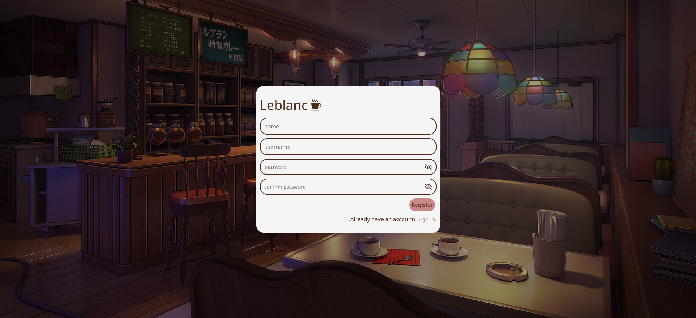
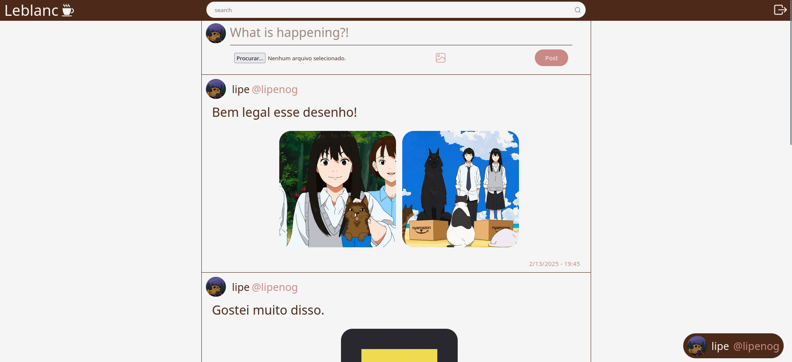
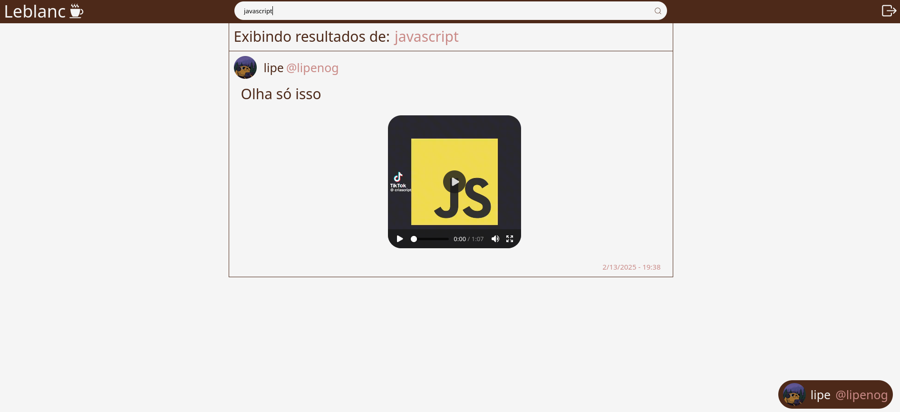

# LeBlanc

LeBlanc is a microservices-based platform that enables users to share posts and discover content. The core feature of this project is its video-processing pipeline. When a user uploads a video, the system leverages Python Whisper to generate a transcript of the audio. This text is then indexed in Elasticsearch so users can search for content that appears in videos.

## Table of Contents
1. [Architecture Overview](#architecture-overview)  
2. [Services and Ports](#services-and-ports)  
3. [Tech Stack](#tech-stack)  
4. [Running the Project](#running-the-project)  
5. [Images](#images)  

---

## Architecture Overview

LeBlanc is built following a microservices architecture. Each service is responsible for a distinct functionality in the system. Communication between services is handled through REST APIs, and asynchronous messaging is powered by Kafka.

Key features:
- **Video Processing**: Python Whisper is used to transcribe uploaded videos.
- **Search Functionality**: Leveraging Elasticsearch for indexing and searching textual content from video transcripts.
- **Dockerized Deployment**: All services, databases, and search engines run inside Docker containers.

---

## Services and Ports

| Service         | Port  |
|-----------------|-------|
| **API Gateway** | 8765  |
| **Naming Server** | 8761  |
| **User Service** | 9090  |
| **Post Service** | 9000  |
| **Search Service** | 8000  |
| **Kafka KRaft** | 9092  |
| **Front-End**   | 5173  |

---

## Tech Stack

### Backend
- **Java (Spring)**: Core microservices for user and post management
- **PostgreSQL**: Primary relational database for storing user and post data
- **Kafka**: Message queue for handling video processing
- **Elasticsearch**: Full-text search engine for indexing video transcripts
- **Python Whisper**: Used for video-to-text processing

### Frontend
- **TypeScript & React**: Modern web application stack for building dynamic user interfaces
- **HTML & CSS**: Markup and styling for a responsive experience

---

## Running the Project

1. **Clone the repository**  
   ```bash
   git clone https://github.com/your-username/leblanc.git
   cd leblanc
2. **Build and Run**
   Make sure you have Docker installed and running on your machine.
   ```bash
   docker compose up -d --build
3. **Create Elasticsearh index**
   ```bash
   ./posts-mapping/create-mapping.sh
4. **Run the Front-End Application**
   ```bash
   cd frontend
   npm i
   npm run dev
5. **Accessing the Application**
   - API Gateway: http://localhost:8765
   - Front-End: http://localhost:5173/login

## Images



